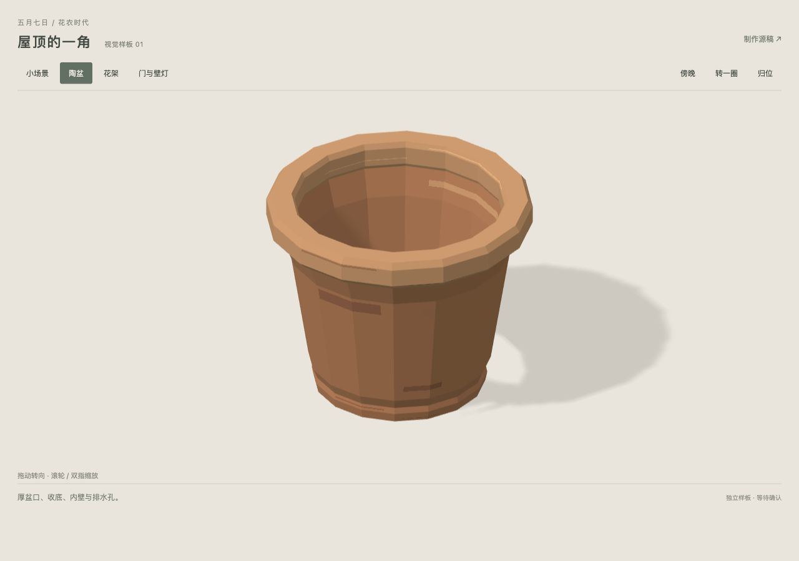

# 花农时代 · 3D Pixel 视觉样板 01

第一批独立视觉样板：陶盆、黑色金属花架、带门与壁灯的建筑局部，以及用于展示的铺地和几枝示意叶片。状态：**未认可，未集成游戏**。

本次接续只取得原会话中 11 张 GIF 的附件占位文字，未取得图像内容。因此这一版根据用户文字中的低多边形轮廓、少量色阶和 32/64/128px 像素贴图要求制作，尚未逐张对照参考 GIF。补齐参考后可在这些可编辑源稿上继续调整。





## 制作与材质

- 实际使用 Blender 4.5.14 LTS 建立模型、UV、场景与灯光，保存 `garden-sample.blend`。各部件按物件分组，制作模型保留独立部件；发布模型合并同材质网格。
- 贴图由明确的逐像素笔触坐标脚本绘制，无照片、随机噪声、平滑渐变或图像生成。`garden-atlas.pxo` 为两层 Pixelorama 原生工程，另保留 ORA、底色层与笔触层 PNG。已通过本机 Pixelorama v1.2.3-stable 实际打开、导出 PNG，并与源像素逐像素核对一致；本轮贴图使用脚本绘制和软件导出流程。
- 一张 128×128 图集，包含 16 个 32×32 材质区域，每种材质 3 个笔触色阶。光照在浏览器中实时计算。纹理使用最近邻采样，不生成 mipmap。
- 网页按正常画布像素渲染并使用抗锯齿。像素感来自物体表面的贴图，不来自整屏降分辨率。
- 陶盆有 16 段截面、厚盆口、内壁、盆底、排水孔和底足。花架有真实两层杆面、背部斜撑、端部把手与脚垫。建筑保留门洞、门框、门板、把手、短墙、檐口与金属壁灯。
- 源 .blend 已打包贴图，打开即可编辑。发布 GLB 不内嵌贴图，在样板页内共用一个 PNG；通用 GLB 查看器单独打开时会显示白模。

## 发布资源体积

| 资产 | 发布文件 | 文件体积 | 三角形 | 网格 |
|---|---|---:|---:|---:|
| 陶盆 | `ceramic-pot.glb` | 43,600 B / 42.6 KiB | 704 | 1 |
| 黑色金属花架 | `metal-rack.glb` | 63,020 B / 61.5 KiB | 840 | 1 |
| 建筑局部、门与壁灯 | `doorway.glb` | 119,720 B / 116.9 KiB | 1,576 | 2 |
| 展示铺地与示意枝叶 | `scene-set.glb` | 54,844 B / 53.6 KiB | 764 | 1 |
| 共享材质 | `garden-atlas.png` | 1,454 B / 1.4 KiB | — | — |

模型和贴图合计 **282,638 B / 276.0 KiB**，不含页面脚本、既有 Three.js 与截图。组合场景复用 5 只同一陶盆，共 6,700 个三角形、9 次绘制。没有 Draco/KTX2 等解码依赖。

## 查看与保存

- 静态预览目录：[`rooftop/previews/pixel-01`](../../../rooftop/previews/pixel-01/)。从仓库根目录启动静态文件服务器后打开 `/rooftop/previews/pixel-01/`。
- 浏览器支持整体场景、单件近看、拖动旋转、双指或滚轮缩放、键盘操作与傍晚灯光。
- 截图位于 [`review/`](review/)，可直接从 GitHub 查看。
- 分支：`preview/rooftop-3d-pixel-samples`。现有 Pages 工作流只自动发布 main；此分支没有部署到正式域名。
- GitHub 保存制作源稿、制作脚本、发布文件、尺寸清单和验证记录。工作目录仅是临时制作与核对环境。
- 现有发布脚本已排除 `docs/`，所以制作源稿和截图不进入网页发布包。本次只增加 `.glb` 的提交版本标记支持；没有修改任何游戏入口、物件资料、植物资料、布局、存档、车库、房间或叙事。

## 重新制作

保留修改后的 PXO 与 Blend 为主要源稿。只有需要恢复初始笔触时才运行 `paint_atlas.py`，它会重建图集工程。

```sh
# 从改好的原生 Pixelorama 工程导出网页贴图
python docs/art/rooftop-pixel-01/export_atlas.py --pixelorama /path/to/Pixelorama
# 从制作脚本重新建立初始模型和样板场景
blender --background --python docs/art/rooftop-pixel-01/build_scene.py
```

`build_scene.py` 会从头重建 .blend，不用于保留已经手工修改的模型。手工修改 .blend 后，应选中相应资产部件按 glTF/GLB 导出，保持 UV、地面原点和物件分组，合并发布副本而非制作原件；GLB 不导出材质，交给预览页面关联共享 PNG。建筑发光玻璃副本名称保留 `Warm_glass`。

## 核对

- Pixelorama 原生工程导出与逐像素核对：[`pixelorama-check.json`](pixelorama-check.json)。
- 实际 Chromium 网页记录：[`browser-check.json`](browser-check.json)。桌面 1280×900、手机 390×844 与 320×740；无横向溢出，无网页错误。
- 整体、三件单件视图、白天/傍晚、归位、旋转、键盘转向/缩放均已核对。四个模型缓存复用，贴图仅加载一次；所有资源来自当前静态目录。
- `prefers-reduced-motion` 的 no-preference、reduce 与实时设置切换下，用户主动开启的旋转均继续可见。
- 现有完整检查通过：338 项测试通过；语言、物种、环境、叙事和公开页面结构检查全部通过。
- 发布包核对：制作源稿排除，GLB/PNG/加载器完整，并能添加提交版本 URL。实际浏览器记录见 [`published-artifact-check.json`](published-artifact-check.json)，四个 GLB 和共享 PNG 带版本参数成功加载，网页无错误。

样板尺寸用于观察造型，尚未映射到游戏中的摆放尺寸、承放面与 ID。用户认可视觉后，正式接入时仍需按原物件数据适配比例，遵守 `rooftop/AGENTS.md` 中的摆放、承放和存档契约。示意枝叶仅用于构图，不代表新增物种或对现有程序化植物的替换。
