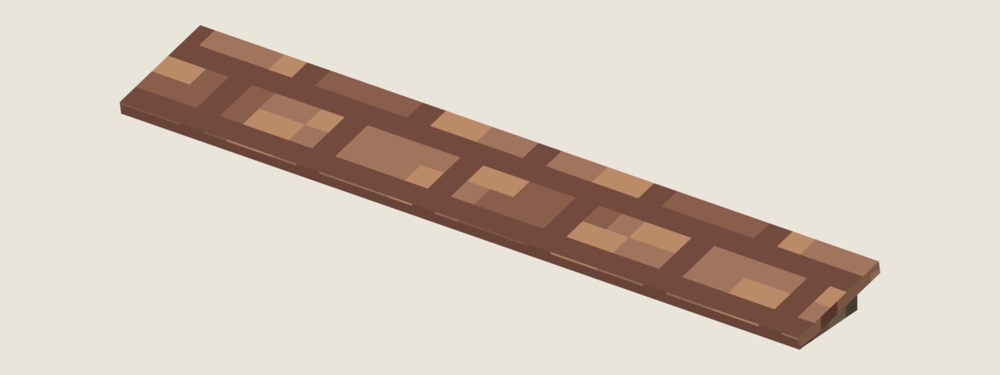

# 花农时代 · 3D Pixel 视觉样板 01

**第 7 版：减少细小几何，以原生粗像素直接表现材质、旧化与明暗。待用户看效果，尚未集成正式游戏。**

原 `garden-atlas.pxo` 与 `garden-sample.blend` 继续修改。屋顶细凸条改为平整折面上的像素瓦缝；取消小倒角、螺丝、铰链和凸起门板，陶盆减至八个侧面。墙、门、地面和铁架使用完整重画的粗像素材质，减少整片同色区域。几何只保留主要形状，表面层次直接画进方格。

图片全部由实际 Blender 打开当前保存的原工程渲染。

## 本轮考察与修改

找到用户参考石灯的[原作者页面](https://artofsully.com/projects/3kOno)，查阅 [PS2《暗云》与其他经典游戏条目](https://www.playstation.com/en-bh/editorial/iconic-must-play-titles-on-playstation-plus-classics-catalog/)，并参考低模像素场景作者的制作说明。链接、各来源的具体信息和本轮取舍记录在 [`reference-study.json`](reference-study.json)。用户给出的石灯和物件参考图是本轮主要视觉标准。

- 将 91 个细小装饰部件从当前可见模型移到隐藏参考中。屋顶仅保留主要折面，所有细倒角改为清晰平面；瓦缝、门板线与破损改用原生像素绘制。
- 原 Pixelorama 工程的每个 32×32 材质区域完整重画：以一像素格组织相连色阶、污渍、木纹、石材与铁表面。颜色属于有限色板，最小单位始终为原生 1px。
- 场景使用四档平面明暗。Blender 材质和网页使用相同的面顶点色，去掉连续光照渐变、反光、AO 和软阴影。傍晚通过整档配色变化表现，灯窗保留像素色阶。
- 相机、组合摆放与整体配色方向沿用原场景；本轮调整对象是样板几何、材质与过于精致的渲染效果。

## 统一方格规则

- 共享图集 **128×128**，含 16 个 **32×32** 材质区域。颜色、木纹、瓦缝、污渍和破损直接由整数坐标的一像素笔触构成。
- 所有平面展开尺度为 **8 像素/米，单格边长 0.125 米**。正交的展开轴保持长度与直角；陶盆、屋檐、灯罩等斜面也遵守同一尺度。
- 不把大小不同的面随意拉伸到整张贴图。展开网格保持统一，最近邻采样不产生模糊中间颜色。
- 大、中、小陶盆分别烘焙尺寸后展开，场景实例缩放均为 `1`，小物件的像素格不会一起缩细。
- 模型由连续平面、梯形与折角组成。屏幕投影随视角倾斜或缩短，展开后的贴图格始终是相同大小的正方形。
- [`review/unfolded-grid.svg`](review/unfolded-grid.svg) 将实际 UV 边界叠在原 Pixelorama 导出材质和辅助网格上，辅助网格不进入发布材质。

## 原文件和实际软件制作

- **`garden-atlas.pxo`**：原三层工程，由实际 Pixelorama v1.2.3-stable 的原生 `Pencil` 工具执行 **9,534 笔整数坐标绘制**，重画 16,384 个原生像素后保存同一文件；本轮没有缩放画布或通过外部程序生成材质 PNG。
- 桌面画布指针存在偏移，因此通过 Pixelorama 作者扩展接口回放指定笔触。记录在 [`pixelorama-clusters/strokes.json`](pixelorama-clusters/strokes.json)，调用代码同目录；四像素小簇由原生一像素格构成，不存在半像素笔触。`author_cluster_materials.py` 是软件调用记录，已执行后再次运行会停止，保护后续原稿编辑。
- `garden-atlas.png` 和三个图层 PNG 均由实际 Pixelorama 导出，与 PXO 原生 cel RGBA 逐字节核对。保留 ORA 分层交换文件。`pixelorama-cluster-authoring.json` 是本轮实际工具记录，`pixelorama-cluster-check.json` 核对原生色板及各材质的颜色占比。
- **`garden-sample.blend`**：实际 Blender 4.5.14 LTS 打开原工程修改。`REFERENCE_FACETS_V6` 隐藏保留前一版；更早版本也在隐藏参考分组。当前模型的盆体、盆口、盆足、花架部件、墙与灯仍可独立编辑。
- `simplify_native_sample.py` 是本轮源文件编辑记录。`finish_native_exports.py` 清理 UV 重复边界的浮点碎面并导出当前原物件；容差仅 0.01 毫米，远小于 125 毫米的一个材质像素。
- 源稿已打包当前 PNG。GLB 保存几何、UV 与四档面顶点色，共享外部 PNG，不内嵌重复贴图。在普通 GLB 查看器中不会自动关联外部材质，独立预览与 Blend 显示完整效果。
- 没有使用图像生成。参考 GIF/JPG 没有复制到公开仓库。

## 发布文件体积

| 资产 | 文件 | 体积 | 三角形 |
|---|---|---:|---:|
| 大陶盆 | `ceramic-pot.glb` | 19,956 B / 19.5 KiB | 208 |
| 小陶盆 | `ceramic-pot-small.glb` | 19,972 B / 19.5 KiB | 208 |
| 中陶盆 | `ceramic-pot-medium.glb` | 19,972 B / 19.5 KiB | 208 |
| 金属花架 | `metal-rack.glb` | 33,836 B / 33.0 KiB | 368 |
| 门、墙与壁灯 | `doorway.glb` | 28,088 B / 27.4 KiB | 288 |
| 铺地与示意植物 | `scene-set.glb` | 11,776 B / 11.5 KiB | 112 |
| 共享材质 | `garden-atlas.png` | 12,397 B / 12.1 KiB | — |

六个 GLB 与 PNG 共 **145,997 B / 142.6 KiB**。组合场景复用三只小盆，共 **1,808 个三角形、9 次物件绘制**。不含网页代码、已有 Three.js 和审阅图片。

## 查看与长期保存

- 分支 `preview/rooftop-3d-pixel-samples`，[草稿 PR #60](https://github.com/fivsevn/umwelt/pull/60)。GitHub 保存原文件、导出文件、实际渲染、笔触和检查记录，本地为制作工作区。
- `review/` 中当前七张 JPG 与 `blender-preview.png` 均为第 7 版真实 Blender 渲染。`wall-texture.png`、`wear-comparison.jpg`、`mobile-*.jpg` 是历史材料。
- 独立静态预览在 [`rooftop/previews/pixel-01`](../../../rooftop/previews/pixel-01/)。从仓库根目录提供静态文件后打开 `/rooftop/previews/pixel-01/`，可转动、缩放、逐件查看和切换傍晚。
- 当前 Pages 只发布 main，预览分支没有部署到正式游戏域名。页面纯静态，不需要 CDN、后端、账号或新增解码依赖。
- 正式游戏的 Three.js、布局、存档、车库、房间、植物数据与叙事保持原状。等待用户认可后再集成。

## 验证

- `pixelorama-export.json`：本轮实际软件导出，三个原生 RGBA 图层逐字节一致。
- `facet-source-check.json`：源文件编辑、细几何归档、同尺度展开、打包材质及四档面明暗。
- `facet-runtime-check.json`：实际预览 GLTFLoader 解析六个 GLB，逐三角形核对展开比例与角度、每个三角形面色恒定；最大长度误差低于万分之一像素。
- `facet-publish-check.json`：纯静态打包、资源版本、共享贴图及制作源文件排除。
- `render-review.json`：七张当前实际 Blender 渲染。
- `grid-*.json`、旧 `pixelorama-authoring.json` 和更早版本检查属于历史材料。
- 沿用此前本地浏览器访问被拒绝的限制，本轮没有绕过，也没有浏览器视觉复测。当前展示的是原工程实际渲染。

后续继续编辑当前 PXO 与 Blend。Pixelorama 保存后运行 `export_atlas.py`；Blender 调整时保留统一贴面尺度、原生最近邻采样和每面恒定的明暗色阶，再导出当前对象。`render_review.py` 只从保存后的原工程渲染，不修改源稿。
