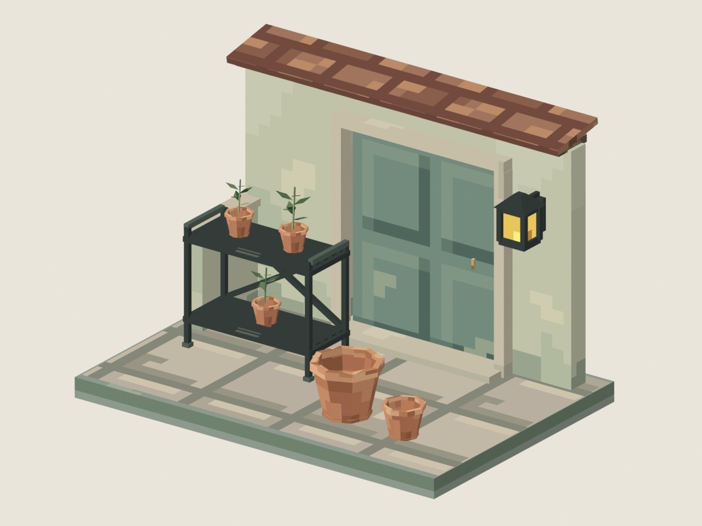
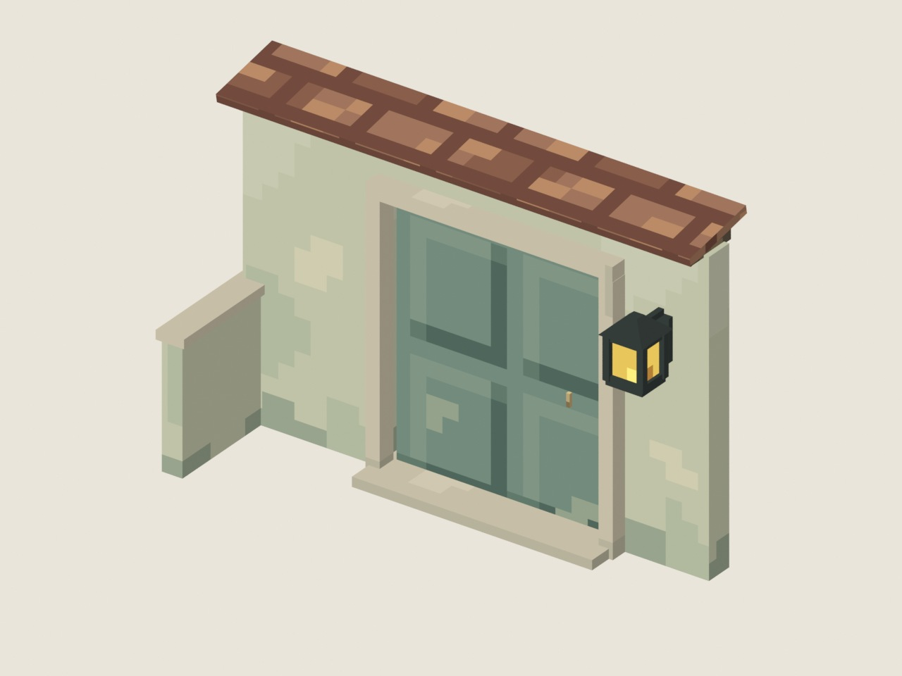
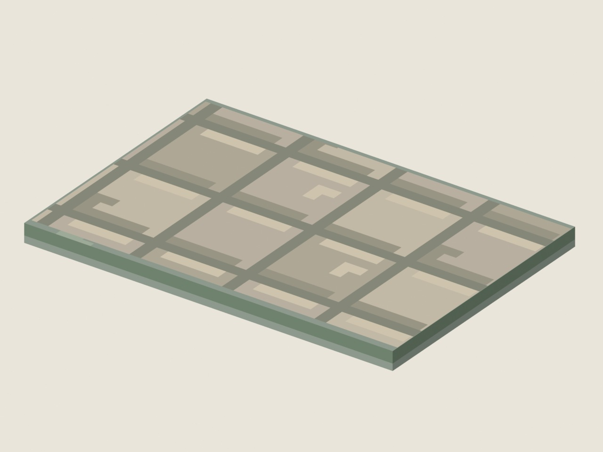
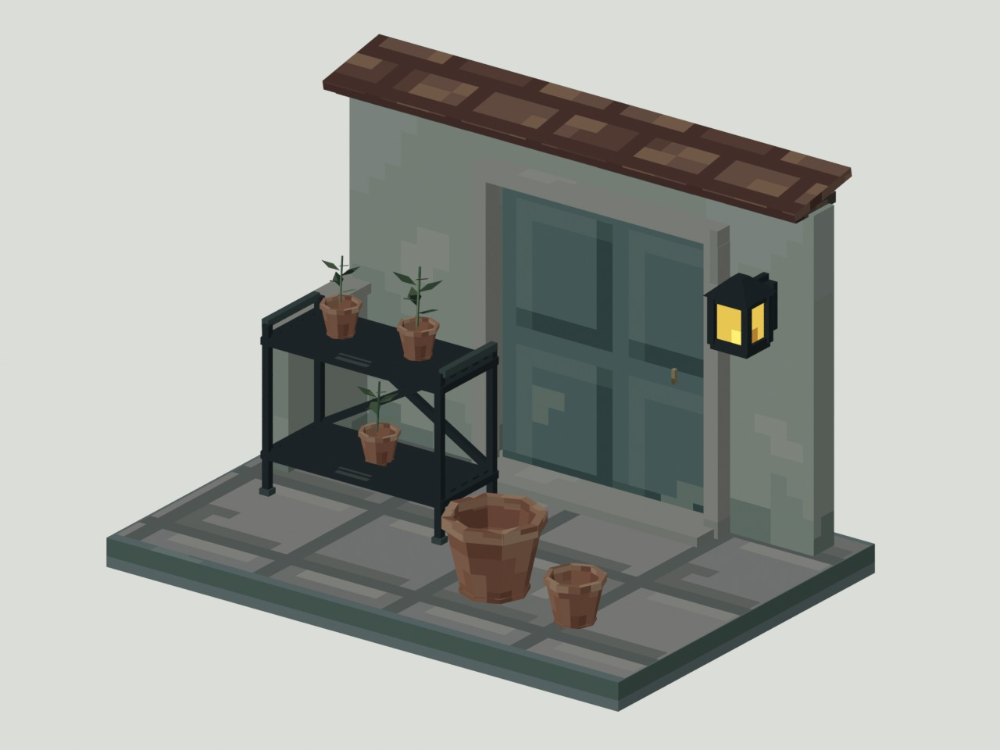

# 花农时代 · 3D Pixel 视觉样板 01

**第 8 版：保持已认可的粗像素与折面轮廓，减少密集碎斑，让像素描绘材料本身。待用户看效果，尚未集成正式游戏。**

本轮继续编辑原 `garden-atlas.pxo`。墙面改为连贯抹灰、局部露底与墙脚潮痕；地面改为整块石板、接缝和少量缺角；门板与金属磨损集中到边缘。原 `garden-sample.blend` 只更新并打包材质，保存后重新打开核对几何、UV、物件摆放、相机和材质节点完全一致。六个 GLB 与上一版逐字节相同。

以下图片均由实际 Blender 打开当前保存的原工程渲染。

[上一版实际渲染，供比较](review/materials-before-v7.jpg)

## 本轮参考与材质取舍

本轮通过网页实际查看 **9 组原作者作品，10 张场景或材质对照图**；对照图内包含多种石板、木板和墙面样例。逐项链接及目视观察记录保存在 [`reference-study.json`](reference-study.json)，搜索缩略图未计入已查看作品。

- Brendan Sullivan：[墙面材质](https://artofsully.com/projects/33eqB)、[办公室与公园铺地](https://artofsully.com/projects/kxaKn)、[室外建筑](https://artofsully.com/projects/32PQB)、[街景](https://artofsully.com/projects/qkoBy)、[旧化神社](https://artofsully.com/projects/qwzZN)、[原神社](https://artofsully.com/projects/BWBO8)、[双叶镇房屋](https://artofsully.com/projects/1038q)。墙、石材、木材与路面分别用自身的结构组织色块。
- [FlakDeau 石板与木板对照](https://flakdeau19.itch.io/64x64-pixel-tileset)：比较材质走向、整块表面与边缝。其细节密度高于本样板目标，仅参考材料结构。
- [Pixel Salvaje 墙地面组合](https://pixel-salvaje.itch.io/isometric-interiors/devlog/1470250/major-expansion-350-walls-and-floors-added-v015)：比较抹灰、木板、砖墙、瓷砖与规则铺地的辨识度。

以上取舍属于本任务的视觉分析。保留用户给出的石灯、物件 GIF 和旧化室内图为主要风格标准。参考素材未下载或复制到公开仓库。

本轮墙面相邻色块边界减少约 **81%**，石板地面减少约 **37%**，均保持原生像素尺寸。颜色按材料位置组织：抹灰使用接近的色阶，潮痕在墙脚，石板用整块色差，磨损在少量边角。

## 统一方格与已认可的模型

- 共享图集 **128×128**，含 16 个 **32×32** 材质区域。所有笔触是整数坐标的原生一像素格，没有缩放画布。
- 所有贴面展开为 **8 像素/米，单格边长 0.125 米**。斜面也保持正交展开轴、统一长度与直角；最近邻采样不混合颜色。
- 不把大小不同的面随意拉伸到整张贴图。大、中、小陶盆分别烘焙尺寸后展开，场景实例缩放均为 `1`。
- 模型由连续平面、梯形与折角组成。屋顶只保留主要折面，瓦缝画在贴图中；八面陶盆、灯、植物和相机沿用第 7 版。
- 四档平面明暗沿用第 7 版，Blender 和网页使用相同面顶点色。傍晚通过整档配色变化表现，灯窗保持原样。
- [`review/unfolded-grid.svg`](review/unfolded-grid.svg) 将真实 UV 边界叠在本轮原生导出材质与辅助网格上，辅助网格不进入发布材质。

## 原文件和实际软件制作

- **`garden-atlas.pxo`**：原三层项目，由实际 Pixelorama v1.2.3-stable 的原生 `Pencil` 工具执行 **1,326 笔整数坐标绘制**，重画九个材质区域的 **9,216 个原生像素**后保存同一文件。
- 通过 Pixelorama 作者扩展接口回放指定的一像素笔触；桌面画布指针存在偏移。记录在 [`pixelorama-materials/strokes.json`](pixelorama-materials/strokes.json)，同目录保留原生调用代码。`author_material_structure.py` 是本轮软件调用记录，完成后再次运行会停止，保护后续编辑。
- 陶盆、土壤、叶片、灯窗、屋顶和黄铜等七个非目标材质区域逐字节保持；下方两个原生图层也逐字节保持。`pixelorama-material-authoring.json` 保存实际工具记录和变化密度。
- `garden-atlas.png` 与三个图层 PNG 由实际 Pixelorama 导出，对原生 cel RGBA 逐字节核对；保留 ORA 分层交换文件。没有外部程序生成材质 PNG。
- **`garden-sample.blend`**：实际 Blender 4.5.14 LTS 打开原工程，只重载并打包最新 PNG。`refresh_native_texture.py` 在保存前后对全部几何、UV、面色、矩阵、分组、相机与材质节点计算签名，重新打开后完全一致。
- 盆体、盆口、盆足、花架部件、墙与灯仍可独立编辑；原隐藏参考分组保持。第 7 版及更早的几何迁移脚本属于历史记录，不应在当前源稿重复运行。
- GLB 保存几何、UV 与面顶点色，共享外部 PNG，避免重复贴图。普通 GLB 查看器不会自动关联外部材质，独立预览与 Blend 显示完整效果。
- 没有使用图像生成。截图和 JPG 均为软件真实渲染。

## 发布文件体积

| 资产 | 文件 | 体积 | 三角形 |
|---|---|---:|---:|
| 大陶盆 | `ceramic-pot.glb` | 19,956 B / 19.5 KiB | 208 |
| 小陶盆 | `ceramic-pot-small.glb` | 19,972 B / 19.5 KiB | 208 |
| 中陶盆 | `ceramic-pot-medium.glb` | 19,972 B / 19.5 KiB | 208 |
| 金属花架 | `metal-rack.glb` | 33,836 B / 33.0 KiB | 368 |
| 门、墙与壁灯 | `doorway.glb` | 28,088 B / 27.4 KiB | 288 |
| 铺地与示意植物 | `scene-set.glb` | 11,776 B / 11.5 KiB | 112 |
| 共享材质 | `garden-atlas.png` | 6,791 B / 6.6 KiB | — |

六个 GLB 与 PNG 共 **140,391 B / 137.1 KiB**。组合场景复用三只小盆，共 **1,808 个三角形、9 次物件绘制**。不含网页代码、已有 Three.js 和审阅图片。

可编辑原稿：PXO **18,232 B**，ORA **22,578 B**，Blend **618,681 B**。

## 查看与长期保存

- 分支 `preview/rooftop-3d-pixel-samples`，[草稿 PR #60](https://github.com/fivsevn/umwelt/pull/60)。GitHub 保存原文件、导出文件、实际渲染、笔触和检查记录，本地为制作工作区。
- `review/` 中八张当前 JPG 与 `blender-preview.png` 是第 8 版实际渲染。`materials-before-v7.jpg` 是 Git 中上一版原始渲染，未重新加工；`wall-texture.png`、`wear-comparison.jpg`、`mobile-*.jpg` 是更早历史材料。
- 独立静态预览在 [`rooftop/previews/pixel-01`](../../../rooftop/previews/pixel-01/)。从仓库根目录提供静态文件后打开 `/rooftop/previews/pixel-01/`，可转动、缩放、逐件查看和切换傍晚。
- 当前 Pages 只发布 main，预览分支未部署到正式游戏域名。页面纯静态，不需要 CDN、后端、账号或新增解码依赖。
- 正式游戏的 Three.js、布局、存档、车库、房间、植物数据与叙事保持原状。等待用户认可后再集成。

## 验证

- `pixelorama-export.json`：本轮实际软件导出，三个原生 RGBA 图层逐字节一致。
- `material-refinement-check.json`：全部 9,216 个目标单格与真实 Pencil 结果一致；六个 GLB 与上一版逐字节一致。
- `facet-source-check.json`：保存并重新打开 Blend，确认几何、UV、摆放、相机、材质节点完全一致，打包 PNG 等于原生导出。
- `facet-runtime-check.json`：实际预览 GLTFLoader 解析六个 GLB，逐三角形核对展开比例与角度、面色恒定；最大长度误差低于万分之一像素。
- `facet-publish-check.json`：纯静态打包、资源版本、共享贴图及制作源文件排除。
- `render-review.json`：八张本轮实际 Blender 渲染。
- `pixelorama-cluster-*.json`、`grid-*.json` 和更早检查属于历史材料。
- 沿用此前本地浏览器访问被拒绝的限制，没有绕过或本地浏览器视觉复测。本轮浏览器仅用于公共参考网页，展示结果为原工程实际渲染。

继续编辑当前 PXO 与 Blend。Pixelorama 保存后运行 `export_atlas.py` 并在 Blender 重载打包材质；模型调整时保留统一贴面尺度、原生最近邻采样和每面恒定明暗。`render_review.py` 只从保存后的原工程渲染，不修改源稿。
