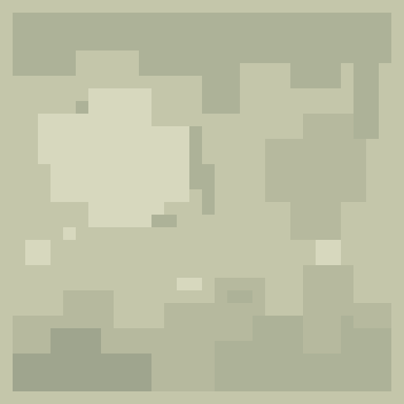

# 花农时代 · 3D Pixel 视觉样板 01

第一批独立视觉样板：陶盆、黑色金属花架、带门与壁灯的建筑局部，以及用于展示的铺地和几枝示意叶片。状态：**大方向已认可；像素旧化版待看效果，未集成游戏**。

此前按用户提供的 13 张参考 GIF 细化了轮廓和材质。本轮依据新增的 `IMG_2327.JPG`，补充相连的阶梯状色块、深浅不同的积污、褪色和掉漆，增加材质的旧化层次。保留原有构图、几何、物件比例、灯光和材质底色，使用原色系邻近色表现旧化。下列新版图片由实际 Blender 离线渲染，网页使用自己的实时光照，效果会略有差异。


## 本轮微调

| 部位 | 调整 | 主要参考 |
|---|---|---|
| 抹灰墙面 | 五种邻近明度；檐下积灰与短水痕、墙脚分层积污、中部褪色抹灰。两种同底色的斑驳分布用于不同墙段 | IMG_2327 的炉体与墙面 |
| 木门与石框 | 两种不同分布的掉漆、短磨损与角部积污，保留宽面板结构；石框增加下部旧痕 | IMG_2327 的柜门与炉口，以及此前门的 GIF |
| 陶盆与金属边缘 | 陶盆补充不规则窑烧深色区和浅色磨损；花架脚垫、端部增加极少量锈色块 | IMG_2327 的器物表面与此前低模 GIF |
| 檐瓦与铺地 | 增加小面积色差与磨损块，保留接缝和原有 UV 方向 | IMG_2327 的木板、梁面与此前建筑 GIF |

新增独立的 `Weathering patches` 图层，可在 Pixelorama 中单独修改或隐藏旧化。墙面纹理仍是 32×32；下图放大显示原始像素，不改变网页画布分辨率。



[上一版与旧化版并排对照](review/wear-comparison.jpg)：左为上一版，右为本版；构图和灯光相同。

沿用上一版的宽面/倒角投影与已修正的门楣接缝。本轮只修改纹理、部分墙面和门板的 UV 对应区域；模型顶点、法线、三角形索引与上一版完全一致。没有临摹或复制参考图中的纹理素材。

## 制作与材质

- 实际使用 Blender 4.5.14 LTS 建立模型、UV、场景与灯光，保存 `garden-sample.blend`。各部件按物件分组，制作模型保留独立部件；发布模型合并同材质网格。
- 贴图由明确的逐像素笔触坐标脚本绘制，无照片、随机噪声、平滑渐变或图像生成。`garden-atlas.pxo` 为三层 Pixelorama 原生工程：底色、结构笔触、旧化色块。另保留 ORA 与各层 PNG。已通过本机 Pixelorama v1.2.3-stable 实际打开、导出 PNG，并与源像素逐像素核对一致。
- 一张 128×128 图集，包含 16 个 32×32 材质区域。墙面用 5 种邻近色，部分旧化材质用 4 种，其余用 3 种。光照在浏览器中实时计算。纹理使用最近邻采样，不生成 mipmap。
- 网页按正常画布像素渲染并使用抗锯齿。像素感来自物体表面的贴图，不来自整屏降分辨率。
- 陶盆有 16 段截面、厚盆口、内壁、盆底、排水孔和底足。花架有真实两层杆面、背部斜撑、端部把手与脚垫。建筑保留门洞、门框、门板、把手、短墙、檐口与金属壁灯。
- 源 .blend 已打包贴图，打开即可编辑。发布 GLB 不内嵌贴图，在样板页内共用一个 PNG；通用 GLB 查看器单独打开时会显示白模。

## 发布资源体积

| 资产 | 发布文件 | 文件体积 | 三角形 | 网格 |
|---|---|---:|---:|---:|
| 陶盆 | `ceramic-pot.glb` | 43,600 B / 42.6 KiB | 704 | 1 |
| 黑色金属花架 | `metal-rack.glb` | 63,020 B / 61.5 KiB | 840 | 1 |
| 建筑局部、门与壁灯 | `doorway.glb` | 119,720 B / 116.9 KiB | 1,576 | 2 |
| 展示铺地与示意枝叶 | `scene-set.glb` | 54,844 B / 53.6 KiB | 764 | 1 |
| 共享材质 | `garden-atlas.png` | 2,453 B / 2.4 KiB | — | — |

模型和贴图合计 **283,637 B / 277.0 KiB**，比上一版增加 784 B，不含页面脚本、既有 Three.js 与截图。组合场景复用 5 只同一陶盆，共 6,700 个三角形、9 次绘制。没有 Draco/KTX2 等解码依赖。

## 查看与保存

- 静态预览目录：[`rooftop/previews/pixel-01`](../../../rooftop/previews/pixel-01/)。从仓库根目录启动静态文件服务器后打开 `/rooftop/previews/pixel-01/`。
- 浏览器支持整体场景、单件近看、拖动旋转、双指或滚轮缩放、键盘操作与傍晚灯光。
- 新版离线效果图位于 [`review/`](review/)，可直接从 GitHub 查看。`mobile-390.jpg` 与 `mobile-320.jpg` 是第一版网页布局核对的历史截图，不代表本轮材质。
- 分支：`preview/rooftop-3d-pixel-samples`。现有 Pages 工作流只自动发布 main；此分支没有部署到正式域名。
- GitHub 保存制作源稿、制作脚本、发布文件、尺寸清单和验证记录。工作目录仅是临时制作与核对环境。
- 现有发布脚本已排除 `docs/`，所以制作源稿和截图不进入网页发布包。本次只增加 `.glb` 的提交版本标记支持；没有修改任何游戏入口、物件资料、植物资料、布局、存档、车库、房间或叙事。

## 重新制作

保留修改后的 PXO 与 Blend 为主要源稿。只有需要恢复初始笔触时才运行 `paint_atlas.py`，它会重建图集工程。

```sh
# 从改好的原生 Pixelorama 工程导出网页贴图
python docs/art/rooftop-pixel-01/export_atlas.py --pixelorama /path/to/Pixelorama
# 从制作脚本重新建立初始模型和样板场景
blender --background --python docs/art/rooftop-pixel-01/build_scene.py
# 从保存的 .blend 离线渲染整体与单件，不覆盖源稿
blender --background --python docs/art/rooftop-pixel-01/render_review.py
```

`build_scene.py` 会从头重建 .blend，不用于保留已经手工修改的模型。手工修改 .blend 后，应选中相应资产部件按 glTF/GLB 导出，保持 UV、地面原点和物件分组，合并发布副本而非制作原件；GLB 不导出材质，交给预览页面关联共享 PNG。建筑发光玻璃副本名称保留 `Warm_glass`。

## 核对

- 本轮三层 Pixelorama 原生工程实际导出，与分层源图逐像素一致；材质用色数量已逐区域核对：[`pixelorama-check.json`](pixelorama-check.json)。
- 本轮四个 GLB 均由样板页面使用的实际 Three.js r160 GLTFLoader 在 Node 中成功解析，网格数、三角形数、体积与清单一致；UV 有效，顶点、法线和三角形索引逐项与上一版相同：[`refinement-check.json`](refinement-check.json)。
- 实际 Blender 4.5 离线渲染整体白天/傍晚、陶盆、花架与建筑近景，逐张检查材质与画面完整性：[`render-review.json`](render-review.json)。
- 本轮静态发布包核对：制作源稿排除，GLB/PNG/加载器完整，提交版本 URL 正确：[`refinement-publish-check.json`](refinement-publish-check.json)。
- 沿用此前本地浏览器访问被拒绝的限制，本轮未尝试访问或重新进行浏览器视觉测试。页面、样式与交互代码没有修改。第一版实际 Chromium 验证记录仍保留于 [`browser-check.json`](browser-check.json) 和 [`published-artifact-check.json`](published-artifact-check.json)：电脑、390px/320px 手机、整体/单件、灯光、旋转、键盘、缓存及减少动态效果切换均已核对，网页无错误。历史记录不能替代本轮浏览器复测。
- 第一版现有完整检查曾通过：338 项测试；语言、物种、环境、叙事和公开页面结构检查全部通过。此次资产与制作文档微调未重复运行整套游戏检查。

样板尺寸用于观察造型，尚未映射到游戏中的摆放尺寸、承放面与 ID。用户认可视觉后，正式接入时仍需按原物件数据适配比例，遵守 `rooftop/AGENTS.md` 中的摆放、承放和存档契约。示意枝叶仅用于构图，不代表新增物种或对现有程序化植物的替换。
